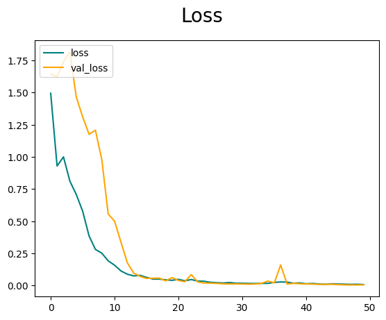
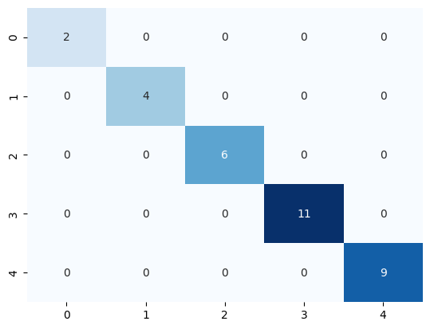

# Product_Category_Classification
A CNN built for classifying images of product to their categories (Fashion - Artifacts - .....)

## Steps for building the model:
### 1. Collect Data
   * Collect images for the five categories (Accessories, Artifacts, Fashion, Home, Stationary).
   * Collect almost 100 image for each category. [Dataset Link](https://drive.google.com/drive/folders/1i9u_fUXgoeycuLAj_00z67_-gpJRKQEP?usp=drive_link)
### 2. Preprocess Data
   After collecting the data, we needed to normalize all the pixels values to be value betwwen [0,1] as it fosters stability in the optimization process, promoting faster convergence during gradient-based training.
### 3. Build the model architecture
   We build the CNN needed for the model as follows:
   ```
   model = tf.keras.models.Sequential([
    tf.keras.layers.InputLayer(input_shape=(256,256,3)),
    tf.keras.layers.Conv2D(64, kernel_size=(6, 6), padding='valid', activation='relu'),
    tf.keras.layers.BatchNormalization(),
    tf.keras.layers.MaxPooling2D(pool_size=(2, 2)),
    tf.keras.layers.Conv2D(16, kernel_size=(3, 3), padding='valid', activation='relu'),
    tf.keras.layers.BatchNormalization(),
    tf.keras.layers.MaxPooling2D(pool_size=(2, 2)),
    tf.keras.layers.Flatten(),
    tf.keras.layers.Dense(64, activation='relu'),
    tf.keras.layers.BatchNormalization(),
    tf.keras.layers.Dropout(0.1),
    tf.keras.layers.Flatten(),
    tf.keras.layers.Dense(16, activation='relu'),
    tf.keras.layers.BatchNormalization(),
    tf.keras.layers.Dropout(0.1),
    tf.keras.layers.Dense(num_classes, activation='softmax')
    ])
   ```
   ```
      Model: "sequential_18"
   _________________________________________________________________
    Layer (type)                Output Shape              Param #   
   =================================================================
    conv2d_48 (Conv2D)          (None, 251, 251, 64)      6976      
                                                                    
    batch_normalization_60 (Ba  (None, 251, 251, 64)      256       
    tchNormalization)                                               
                                                                    
    max_pooling2d_48 (MaxPooli  (None, 125, 125, 64)      0         
    ng2D)                                                           
                                                                    
    conv2d_49 (Conv2D)          (None, 123, 123, 16)      9232      
                                                                    
    batch_normalization_61 (Ba  (None, 123, 123, 16)      64        
    tchNormalization)                                               
                                                                    
    max_pooling2d_49 (MaxPooli  (None, 61, 61, 16)        0         
    ng2D)                                                           
                                                                    
    flatten_32 (Flatten)        (None, 59536)             0         
                                                                    
    dense_54 (Dense)            (None, 64)                3810368   
                                                                    
    batch_normalization_62 (Ba  (None, 64)                256       
    tchNormalization)                                               
                                                                    
    flatten_33 (Flatten)        (None, 64)                0         
                                                                    
    dense_55 (Dense)            (None, 16)                1040      
                                                                    
    batch_normalization_63 (Ba  (None, 16)                64        
    tchNormalization)                                               
                                                                    
    dense_56 (Dense)            (None, 5)                 85        
                                                                    
   =================================================================
   Total params: 3828341 (14.60 MB)
   Trainable params: 3828021 (14.60 MB)
   Non-trainable params: 320 (1.25 KB)
   _________________________________________________________________
   ```

### 4. Train the model
   Then, train the model for 50 Epochs until we reach a validation acuuracy of almost 1
   ```
   Epoch 1/50
   10/10 [==============================] - 11s 612ms/step - loss: 1.4946 - accuracy: 0.4094 - val_loss: 1.6463 - val_accuracy: 0.2396
   Epoch 2/50
   10/10 [==============================] - 7s 569ms/step - loss: 0.9294 - accuracy: 0.6906 - val_loss: 1.6215 - val_accuracy: 0.3438
   Epoch 3/50
   10/10 [==============================] - 9s 601ms/step - loss: 1.0001 - accuracy: 0.6906 - val_loss: 1.7391 - val_accuracy: 0.3125
   Epoch 4/50
   10/10 [==============================] - 9s 732ms/step - loss: 0.8120 - accuracy: 0.7094 - val_loss: 1.8178 - val_accuracy: 0.3229
   Epoch 5/50
   10/10 [==============================] - 7s 574ms/step - loss: 0.7085 - accuracy: 0.7750 - val_loss: 1.4666 - val_accuracy: 0.4167
   Epoch 6/50
   10/10 [==============================] - 8s 700ms/step - loss: 0.5789 - accuracy: 0.8062 - val_loss: 1.3116 - val_accuracy: 0.4688
   Epoch 7/50
   10/10 [==============================] - 8s 638ms/step - loss: 0.3866 - accuracy: 0.9281 - val_loss: 1.1763 - val_accuracy: 0.6042
   Epoch 8/50
   10/10 [==============================] - 8s 593ms/step - loss: 0.2812 - accuracy: 0.9656 - val_loss: 1.2073 - val_accuracy: 0.4583
   Epoch 9/50
   10/10 [==============================] - 9s 715ms/step - loss: 0.2517 - accuracy: 0.9563 - val_loss: 0.9789 - val_accuracy: 0.6458
   Epoch 10/50
   10/10 [==============================] - 8s 615ms/step - loss: 0.1922 - accuracy: 0.9750 - val_loss: 0.5568 - val_accuracy: 0.8646
   Epoch 11/50
   10/10 [==============================] - 9s 610ms/step - loss: 0.1582 - accuracy: 0.9781 - val_loss: 0.5003 - val_accuracy: 0.9062
   Epoch 12/50
   10/10 [==============================] - 9s 711ms/step - loss: 0.1136 - accuracy: 0.9937 - val_loss: 0.3373 - val_accuracy: 0.9792
   Epoch 13/50
   10/10 [==============================] - 7s 592ms/step - loss: 0.0881 - accuracy: 0.9937 - val_loss: 0.1768 - val_accuracy: 1.0000
   Epoch 14/50
   10/10 [==============================] - 10s 778ms/step - loss: 0.0750 - accuracy: 0.9969 - val_loss: 0.0959 - val_accuracy: 1.0000
   Epoch 15/50
   10/10 [==============================] - 8s 707ms/step - loss: 0.0793 - accuracy: 0.9969 - val_loss: 0.0713 - val_accuracy: 1.0000
   Epoch 16/50
   10/10 [==============================] - 9s 779ms/step - loss: 0.0637 - accuracy: 1.0000 - val_loss: 0.0556 - val_accuracy: 1.0000
   Epoch 17/50
   10/10 [==============================] - 8s 607ms/step - loss: 0.0503 - accuracy: 1.0000 - val_loss: 0.0570 - val_accuracy: 1.0000
   Epoch 18/50
   10/10 [==============================] - 9s 708ms/step - loss: 0.0502 - accuracy: 1.0000 - val_loss: 0.0575 - val_accuracy: 1.0000
   Epoch 19/50
   10/10 [==============================] - 9s 778ms/step - loss: 0.0446 - accuracy: 1.0000 - val_loss: 0.0365 - val_accuracy: 1.0000
   Epoch 20/50
   10/10 [==============================] - 8s 596ms/step - loss: 0.0407 - accuracy: 1.0000 - val_loss: 0.0617 - val_accuracy: 1.0000
   Epoch 21/50
   10/10 [==============================] - 8s 586ms/step - loss: 0.0483 - accuracy: 1.0000 - val_loss: 0.0393 - val_accuracy: 1.0000
   Epoch 22/50
   10/10 [==============================] - 9s 721ms/step - loss: 0.0369 - accuracy: 1.0000 - val_loss: 0.0302 - val_accuracy: 1.0000
   Epoch 23/50
   10/10 [==============================] - 7s 585ms/step - loss: 0.0468 - accuracy: 0.9969 - val_loss: 0.0850 - val_accuracy: 0.9792
   Epoch 24/50
   10/10 [==============================] - 9s 642ms/step - loss: 0.0349 - accuracy: 1.0000 - val_loss: 0.0288 - val_accuracy: 1.0000
   Epoch 25/50
   10/10 [==============================] - 9s 766ms/step - loss: 0.0334 - accuracy: 1.0000 - val_loss: 0.0198 - val_accuracy: 1.0000
   Epoch 26/50
   10/10 [==============================] - 7s 579ms/step - loss: 0.0255 - accuracy: 1.0000 - val_loss: 0.0193 - val_accuracy: 1.0000
   Epoch 27/50
   10/10 [==============================] - 8s 696ms/step - loss: 0.0222 - accuracy: 1.0000 - val_loss: 0.0169 - val_accuracy: 1.0000
   Epoch 28/50
   10/10 [==============================] - 8s 617ms/step - loss: 0.0198 - accuracy: 1.0000 - val_loss: 0.0138 - val_accuracy: 1.0000
   Epoch 29/50
   10/10 [==============================] - 8s 579ms/step - loss: 0.0233 - accuracy: 1.0000 - val_loss: 0.0121 - val_accuracy: 1.0000
   Epoch 30/50
   10/10 [==============================] - 9s 709ms/step - loss: 0.0183 - accuracy: 1.0000 - val_loss: 0.0134 - val_accuracy: 1.0000
   Epoch 31/50
   10/10 [==============================] - 7s 586ms/step - loss: 0.0179 - accuracy: 1.0000 - val_loss: 0.0123 - val_accuracy: 1.0000
   Epoch 32/50
   10/10 [==============================] - 9s 644ms/step - loss: 0.0162 - accuracy: 1.0000 - val_loss: 0.0106 - val_accuracy: 1.0000
   Epoch 33/50
   10/10 [==============================] - 9s 772ms/step - loss: 0.0160 - accuracy: 1.0000 - val_loss: 0.0123 - val_accuracy: 1.0000
   Epoch 34/50
   10/10 [==============================] - 7s 567ms/step - loss: 0.0170 - accuracy: 1.0000 - val_loss: 0.0170 - val_accuracy: 1.0000
   Epoch 35/50
   10/10 [==============================] - 8s 703ms/step - loss: 0.0172 - accuracy: 1.0000 - val_loss: 0.0349 - val_accuracy: 0.9896
   Epoch 36/50
   10/10 [==============================] - 7s 580ms/step - loss: 0.0246 - accuracy: 0.9969 - val_loss: 0.0211 - val_accuracy: 1.0000
   Epoch 37/50
   10/10 [==============================] - 7s 568ms/step - loss: 0.0280 - accuracy: 0.9969 - val_loss: 0.1599 - val_accuracy: 0.9688
   Epoch 38/50
   10/10 [==============================] - 8s 660ms/step - loss: 0.0266 - accuracy: 1.0000 - val_loss: 0.0119 - val_accuracy: 1.0000
   Epoch 39/50
   10/10 [==============================] - 9s 771ms/step - loss: 0.0183 - accuracy: 1.0000 - val_loss: 0.0173 - val_accuracy: 1.0000
   Epoch 40/50
   10/10 [==============================] - 7s 585ms/step - loss: 0.0204 - accuracy: 0.9969 - val_loss: 0.0143 - val_accuracy: 1.0000
   Epoch 41/50
   10/10 [==============================] - 9s 713ms/step - loss: 0.0139 - accuracy: 1.0000 - val_loss: 0.0121 - val_accuracy: 1.0000
   Epoch 42/50
   10/10 [==============================] - 9s 782ms/step - loss: 0.0162 - accuracy: 1.0000 - val_loss: 0.0117 - val_accuracy: 1.0000
   Epoch 43/50
   10/10 [==============================] - 8s 599ms/step - loss: 0.0119 - accuracy: 1.0000 - val_loss: 0.0091 - val_accuracy: 1.0000
   Epoch 44/50
   10/10 [==============================] - 9s 718ms/step - loss: 0.0099 - accuracy: 1.0000 - val_loss: 0.0098 - val_accuracy: 1.0000
   Epoch 45/50
   10/10 [==============================] - 9s 776ms/step - loss: 0.0132 - accuracy: 1.0000 - val_loss: 0.0099 - val_accuracy: 1.0000
   Epoch 46/50
   10/10 [==============================] - 8s 608ms/step - loss: 0.0117 - accuracy: 1.0000 - val_loss: 0.0070 - val_accuracy: 1.0000
   Epoch 47/50
   10/10 [==============================] - 9s 712ms/step - loss: 0.0106 - accuracy: 1.0000 - val_loss: 0.0056 - val_accuracy: 1.0000
   Epoch 48/50
   10/10 [==============================] - 9s 778ms/step - loss: 0.0091 - accuracy: 1.0000 - val_loss: 0.0048 - val_accuracy: 1.0000
   Epoch 49/50
   10/10 [==============================] - 7s 598ms/step - loss: 0.0104 - accuracy: 1.0000 - val_loss: 0.0049 - val_accuracy: 1.0000
   Epoch 50/50
   10/10 [==============================] - 9s 720ms/step - loss: 0.0078 - accuracy: 1.0000 - val_loss: 0.0055 - val_accuracy: 1.0000
   ```
### 5. Evaluate the model
   When we try the model on test data, it gives an acurracy of almost 1.0
   
   
   The Confusion Matrix of the model:
   
   The Precision, Recall and F1 score are as follows:
   ```
       precision    recall  f1-score   support
   
              0       1.00      1.00      1.00         2
              1       1.00      1.00      1.00         4
              2       1.00      1.00      1.00         6
              3       1.00      1.00      1.00        11
              4       1.00      1.00      1.00         9
   
       accuracy                           1.00        32
      macro avg       1.00      1.00      1.00        32
   weighted avg       1.00      1.00      1.00        32
   ```
